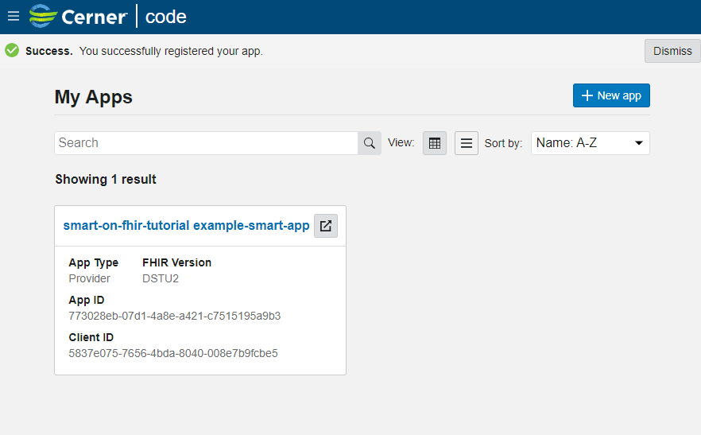
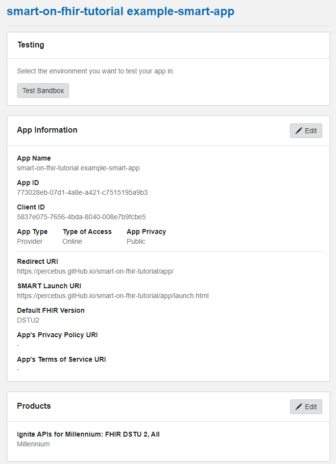
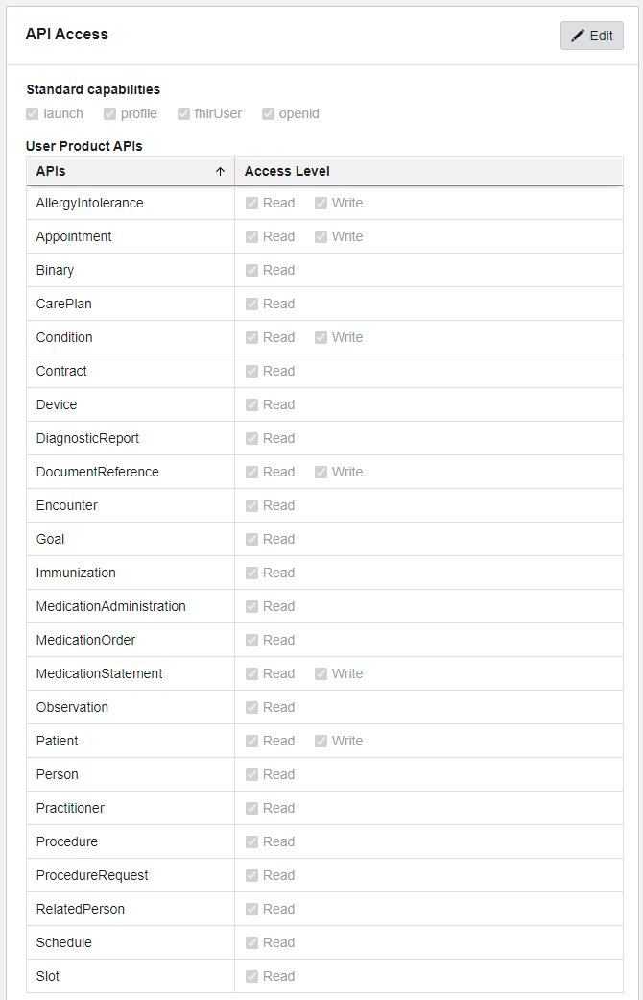
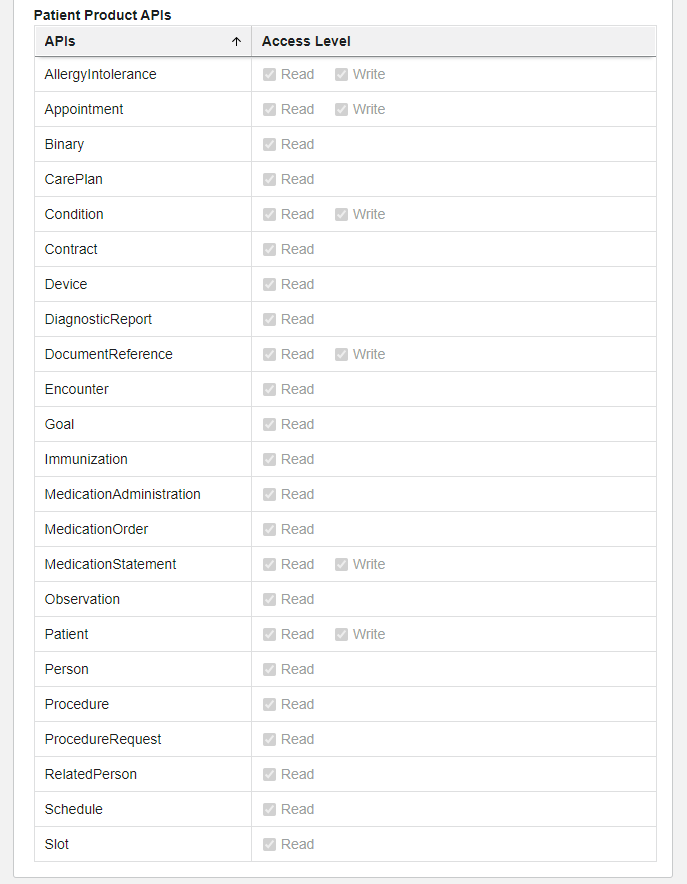
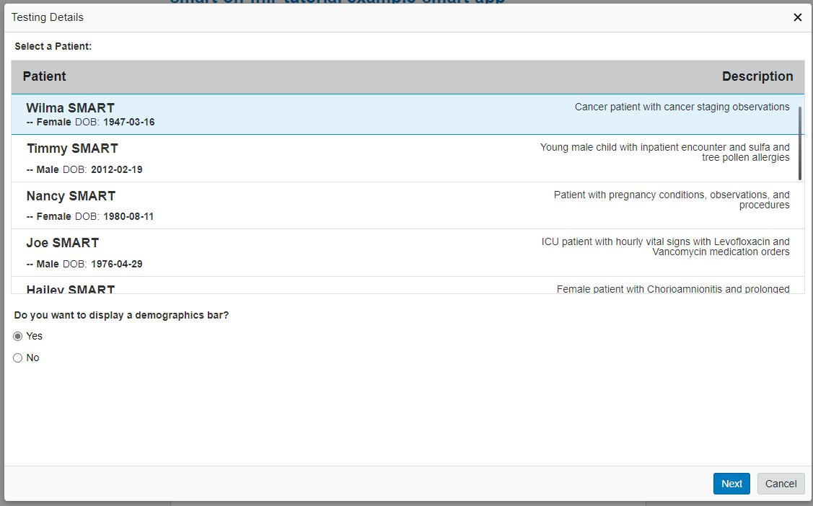
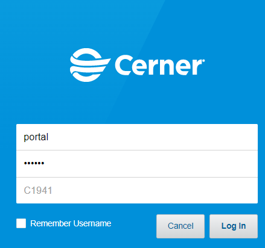
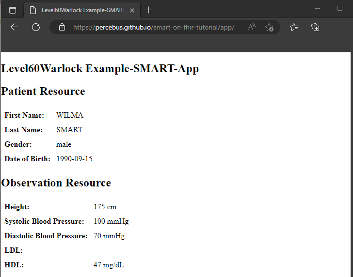

# Cerner

## SMART-on-FHIR 

### Tutorial

See [SMART on FHIR developer tutorial](https://engineering.cerner.com/smart-on-fhir-tutorial/)

#### Local copy 

```bash
$> serve docs/tutorial
```

#### code-console



##### App








##### Test Sandbox

###### Wilma SMART






